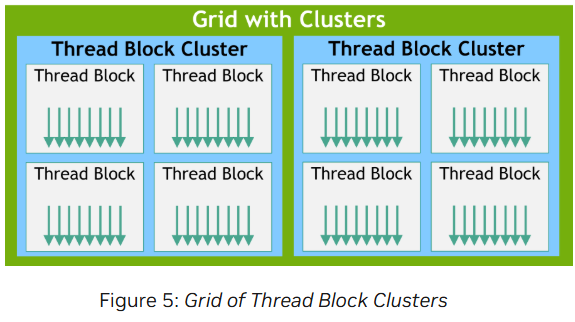

## Thread Block Clusters

- CUDA programming model introduces an optional level of hierarchy called Thread Block Clusters that are made up of thread blocks.

- Similar to how threads in a thread block are guaranteed to be co-scheduled on a streaming multiprocessor, thread blocks in a cluster are also guaranteed to be co-scheduled on a GPU Processing Cluster (GPC) in the GPU.

- Similar to thread blocks, clusters are also organized into a one-dimension, two-dimension or three-dimension grid of thread block clusters.

- The number of thread blocks in a cluster is user defineed, and a maximum of 8 thread blocks in a cluster is supported as a portable cluster size in CUDA.

- On GPU hardware or MIG configurations which are too small to support 8 multiprocessors the maximum cluster size will be reduced accordingly.

- Identification of these smaller configurations, as well as of larger configurations supporting a thread block cluster size beyond 8, is architecture specific and can be queried using the `cudaOccupancyMaxPotentialClusterSize` API

In a kernel launched using cluster support, the gridDim variable still denotes the size in terms of number of thread blocks, for compatibility purposes. The rank of a block in a cluster can be found using the Cluster Group API.

- A thread block cluster can be enabled in a kernel either using a compile-time kernel attribute using `__cluster_dims__(X,Y,Z)` or using the CUDA kernel launch API `cudaLaunchKernelEx`

- The cluster size using kernel attribute is fixed  at compile time and then the kernel can be launched using the classical `<<< , >>>`. If a kernel uses compile-time cluster size, the cluster size cannot be modified when launching the kernel.

- A thread block cluster size can also be set at runtime and the kernel can be launched using the CUDA kernel launch API `cudaLaunchKernelEx`

- In GPUs with compute capability 9.0, all the thread blocks in the cluster are guaranteed to be co-scheduled on a single GPU Processing Cluster (GPC) and allow thread blocks in the cluster to perform hardware-supported synchronization using the Cluster Group API `cluster.sync()`. Cluster group also provides member functions to query cluster group size in terms of number of threads or number of blocks using num_threads() and num_blocks() API respectively. The rank of a thread or block in the cluster group can be queried using dim_threads() and dim_blocks() API respectively.

- Thread blocks that belong to a cluster have access to the Distributed Shared Memory. Thread blocks in a cluster have the ability to read, write, and perform atomics to any address in the distributed shared memory