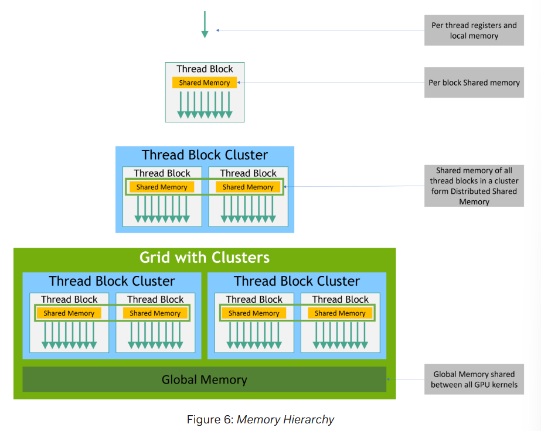
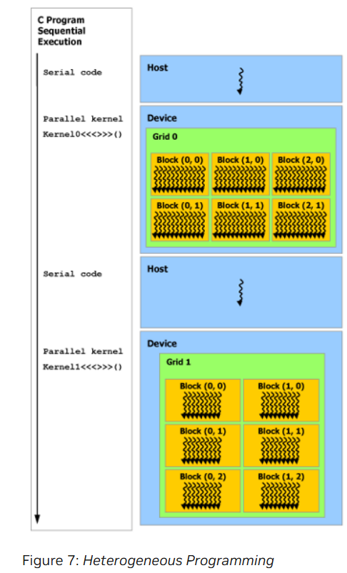

## Memory Hierarchy

- CUDA threads may access data from multiple memory spaces during their execution.

- Each thread has private local memory. Each thread block has shared memory visibe to all threads of the block and has the same lifetime as the block.

- Thread blocks in a thread block cluster can perform read, write and atomics operation on each other's shared memory.

- All threads have access to the same global memory.

- There are also two additional read-only memory spaces accessible by all threads: the constant and texture memory spaces.

- The global, constant and texture memory spaces are optimized for different use cases.

- Texture memory also offers different addressing modes, as well as data filtering, for some specific data formats.

- The global, constant and texture memory spaces are persistent across kernel launches by the same application.

## Heterogeneous Programming

- The CUDA programming model assumes that the CUDA threads execute on a physically separate device that operates as a coprocessor to the host running the C++ program

- The CUDA programming model also assumes tha both the host and the device maintain their own separate memory spaces in DRAM, referred to as host memory and device memory, respectively/

- Therefore, a program manages the global, constant and texture memory spaces visible tp kernels through calls to the CUDA runtime.

- This includes device memory allocation and deallocation as well as data transfer between host and device memory.

- Unified memory provides managed memory to bridge the host and device memory spaces.

- Managed memory is accessible from all CPUs and GPUs in the system as a single, coherent memory imahe with a common address space.

- This capability enables oversubscription of device memory and can greatly simplify the task of porting applications eliminating the need to explicitly mirror data on host and device

- Serial code executes on the host while parallel code executes on the device.