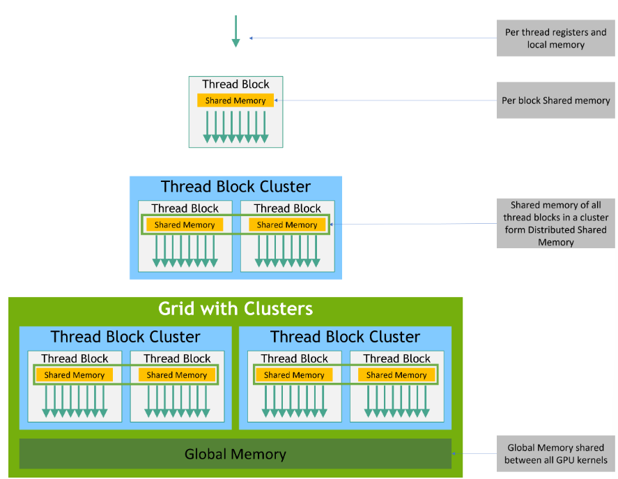

## Memory Hierarchy

- CUDA threads may access data from multiple memory spaces during their execution
- Each thread has private local memory.
- Each thread block has shared memory visible to all threads of the block and with the same lifetime as the block.
- Thread blocks in a thread block can perform read, write and atomics operations on each other's shared memory. All threads have access to the same global memory.

- There are also two additional read-only memory spaces accessible by all threads : the constant and texture memory spaces.
- The global, constant and texture memory spaces are optimized for different memory spaces.
- Texture memory also offers different addressing modes, as well as data filtering, for some specific data formats

- The global, constant and texture memory spaces are persistent across kernel launches by the same application

## Heterogeneous Programming

Assumptions of CUDA programming model : 

- CUDA threads execute on a physically separate device that operates as a coprocessor to the host running the C++ program.
- Both the host and the device maintain their own separate memory spaces in DRAM, referred to as host memory and device memory respectively.

- A program manages the global, constant, and texture memory spaces visible to kernels through calls to the CUDA runtime. This includes device memory allocation and deallocation as well as data transfer between host and device memory.

- Unified Memory provides managed memory to bridge the host and the device memory spaces.
- Managed memory is accessible from all CPUs and GPUs in the system as a single, coherent memory image with a common address space.
- This capability enables oversubscription of device memory and can greatly simplify the task of porting applications by eliminating the need to explicitlly mirror data on host and device

## Asynchronous SIMT Programming Model
- The CUDA programming model provides acceleration to memory operations via the asynchronous programming model.
- The asynchronous programming model defines the behavior of asynchronous operations with respect to CUDA threads.
- The model also explains and defines how cuda::memcpy_async can be used to move data asynchronously from global memory while computing in the GPU.

## Asynchronous Operations