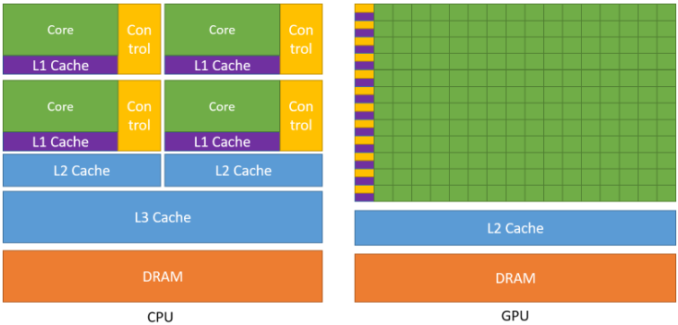
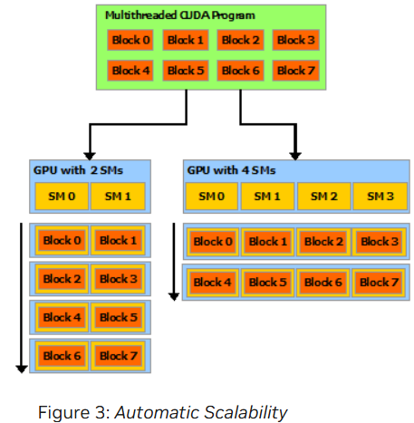
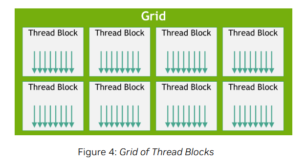

# CUDA Programming Notes

## Introduction

### The Benefits of using GPUs

- GPUS provide higher instruction throughput and memory bandwidth than CPUs within a similar price and power range

- Application that require high parallelism run faster on GPUs than on CPUs

- Other computing devices like FPGAs are energy efficient but less flexible in programming compared to GPUs

- CPU is optimized for executing a few tens of threads sequentially, with high single thread performance

- GPU is designed for massive parallelism, executing thousands of threads simultaneously

- GPUs dedicate more transistors to data processing rather than caching and flow control.

- GPUs excel at highly parallel computation (ex. Floating point operations)

- Memory access latency is hidden by computation rather than avoided with caches and control logic

- GPUs achieve greater overall throughput by distributing resources efficiently across multiple threads.

- Real-world applications contain a mix of parallel and sequential operations.

- Systems use both CPUs and GPUs to balance performance and optimize execution speed

- Applications with high parallelism benefit the most from GPU acceleration.

### Scalable Programming Model (CUDA)

- Modern multicore CPUs and many GPUs require software that can scale parallelism efficiently

- 3D graphics applications already scale seamlessly to GPUs with varying core counts

- CUDA Programming Model 
    - Designed for scalability while maintaining a low learning curve 
    - Provides three key abstractions
        1. Hierarchy of thread groups
        2. Shared Memory
        3. Barrier synchronization

- Parallelism Abstractions
    - Fine grained data parallelism and thread parallelism within coarse grained task parallelism

    - Problems are partitioned into:
        - Coarse sub-problems : solved independently by blocks of threads
        - Finer pieces: solved cooperatively by threads within a block.
    
    - Automatic scalability: CUDA programs can run on any number of multiprocessors without modifications

- GPU Architecture Scalability

    - GPUs consist of Streaming Multiprocessors (SMs)
    - More SM -> Faster execution due to higher parallel workload distribution
    - GPU product lines scale by varying multiprocessors and memory partitions

## Programming Model

### Kernels

- CUDA C++ extends C++ by allowing the programmer to define C++ functions, called kernels.

- These functions when called are executed N times in parallel by N different CUDA threads, as opposed to only once like regular C++ functions.

- A kernel is defined using the `__global__` declaration specifier and the number of CUDA threads that execute the kernel for a given kernel call is specified using a new `<<<...>>>` execution configuration syntax

- Each thread that executes the kernel is given a unique thread ID that is accessible within the kernel through built-in variables

### Thread Hierarchy

- `threadIdx` is a 3-component vector, so that threads can be identified using a one-dimensional, two-dimensional or three-dimensional thread index.

- They together form a one-dimensional, two-dimensional or three-dimensional block of threads, called a thread block.

- The index of a thread and its thread ID relate to each other as follows:
    - For a 1-D block they are the same
    - For a 2-D block of size (Dx, Dy), the thread ID of a thread of index (x, y) is (x + y Dx)
    - For a 3-D block of size (Dx, Dy, Dz), the thread ID of a thread of index (x, y, z) is (x + y Dx + z Dx Dy).

- There is a limit to the number of threads per block, since all threads of a block are expected to reside on the same streaming multiprocessor core and must share the limited memory resources of that core.

- On current GPUs, a thread block may contain up to 1024 threads.

- A kernel can be executed by multiple equally-shaped thread blocks, so that the total number of threads is equal to the number of threads per block times the number of blocks.

- Blocks are organized into a 1-D, 2-D or 3-D grid of thread blocks.

- The numbe rof thread blocks is usually dictated by the size of the thread block being processed, which typically exceeds the number of processors in the system

- The number of threads per block and the number of blocks per grid specified in the `<<<...>>>` syntax can be of type `int` or `dim3`. 

- Each block within the grid can be identified by a 1-D, 2-D or 3-D unique index accessible within the kernel through the builti `blockIdx` variable.

- The dimension of the thread block is accessible within the kernel through the built-in `blockDim` variable.

- Thread blocks are required to execute independently. It must be possible to execute blocks in any order, in parallel or in series.

- This independence requirement allows thread blocks to be scheduled in any order and across any number of cores enabling programmers to write code that scales with the number of cores.

- Threads within a block can cooperate by sharing data through some shared memory and by synchronizing their execution to coordinate memory accesses.

- One can specify synchronization points in the kernel by calling the `__syncthreads()` intrinsic function

`__syncthreads()` acts as a barrier at which all threads in the block must wait before any is allowed to proceed.

