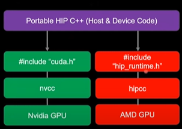
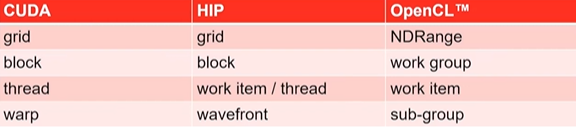

# ROCm : Radeon Open Compute Platform

- Heterogeneous compute Interface for Portability (HIP) is part of a larger software distribution, called the Radeon Open Compute Platform, or ROCm.
- The ROCm package provides libraries and programming tools for developing HPC and ML applications on AMD GPUs
- All the ROCm environment and the libraries are provided from the supercomputer, usually, there is no need to install something yourselves
- Heterogeneous System Architecture (HSA) runtime is an API that exposes the necessary interfaces to access and interact with the hardware driven by AMDGPU driver

## HIP Concepts

### What is HIP ?

AMD's Heterogeneous compute Interface for Portability, or HIP, is a C++ runtime API and kernel language that allows developers to create portable applications that can run on AMD's accelerators as well as CUDA devices.

HIP:
- is open source
- Provides and API for an application to leverage GPU acceleration for both AMD and CUDA devices.
- Syntactically similar to CUDA. Most CUDA API calls can be converted in place. cuda -> hip
- Supports a strong subset of CUDA runtime functionality

### Host and Devices

Source code in HIP has two flavors: Host code and Device code
- The host is the CPU
- Host code runs here
- Usual C++ syntax and features
- Entry point is the 'main' function
- HIP API can be used to create device buffers, move between host and device and launch device code.
- The device is the GPU
- Device code runs here
- C-like syntax
- Device codes are launched via "kernels"
- Instructions from the host are enqueued into "streams"

### HIP API
#### Device Management
- `hipSetDevice()`, `hipGetDevice()`, `hipGetDeviceProperties()`
#### Memory Management
- `hipMalloc()`, `hipMemcpy()`, `hipMemcpyAsync()`, `hipFree()`
#### Streams
- `hipStreamCreate()`, `hipSynchronize()`, `hipStreamSynchronize()`, `hipStreamFree()`
#### Events
- `hipEventCreate()`, `hipEventRecord()`, `hipStreamWaitEvent()`, `hipEventElapsedTime()`
#### Device Kernels
- `threadIdx`, `blockIdx`, `blockDim`, `__shared__`
- 200+ math functions covering entire CUDA math library
#### Error Handling
- `hipGetLastError()`, `hipGetErrorString()`

### Kernels, Memory Structure and Code

- In HIP, kernels are executed on a 3D grid.
- The grid is what you can map your problem to.
- AMD devices (GPUs) support 1D, 2D and 3D grids, but most work maps well to 1D.
- Each dimension of the grid partitioned into equal sized "blocks"
- Each block is made up of multiple "threads"
- The grid and its associated blocks are just organizational constructs
- The threads are the things that do the work

### The Grid: blocks of threads in 1D

Threads in grid have access to:
- Their respective block: blockIdx.x
- Their respective thread ID in a block: threadIdx.x
- Their block's dimension: blockDim.x
- The number of blocks in the grid: gridDim.x

### The Grid: block of thread in 2D

Threads in grid have access to:
- Their respective block IDs: blockIdx.x, blockIdx.y
- Their respective thread IDs in a block: threadIdx.x, threadIdx.y
- Their block's dimensions: blockDim.x, blockDim.y
- The number of blocks in the grid: gridDim.x, gridDim.y

### Kernels